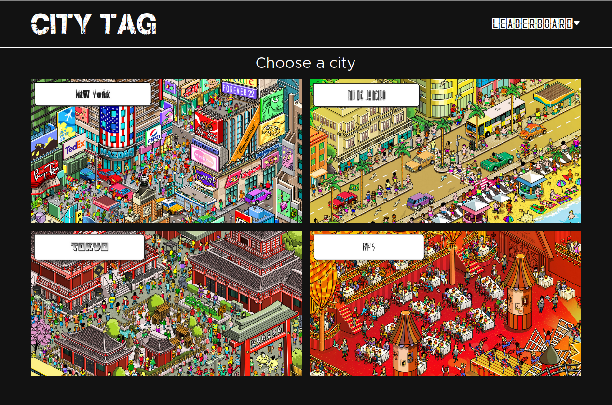

# City Tag

============

[Live Demo](https://abstractdev.github.io/city-tag/) 
A "Seek-And-Find" game similar to Where's Waldo.
All images by Gus Morais.

---

## How To Play
- This is a timed game!
- Pick a city
- Find one of the 4 items/people displayed
- Click on it and select the correct option from the dropdown
- Find all 4 items to end the game
- If your score qualifies it will be added to the leaderboard
## Built With
- Typescript
- Styled Components
- React
- React Icons
- React Router
- Firebase
- GNU Image Manipulation Program
## Concepts / Things I learned
- Typescript basics
- Styled Components basics
- Using coordinates
- Using dropdowns in React/click outside to close
- Using timers
- Creating database schemas
- Using audio with Javascript
- Error handling and validation
---